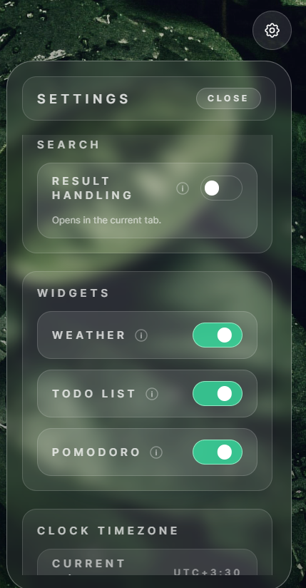
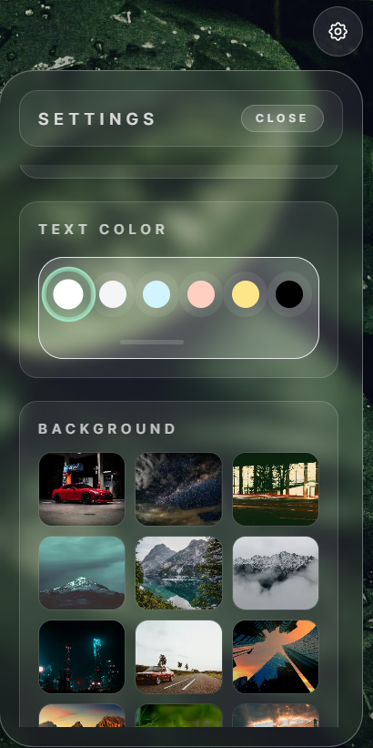

# FocusLoom - Browser-Tab-Focus

> The mindful new-tab dashboard that keeps your search, widgets, and daily focus rituals right where you need them.

[](https://github.com/Mahdirnj/Browser-Tab-Focus/issues)
[](https://github.com/Mahdirnj/Browser-Tab-Focus/stargazers)
[](https://github.com/Mahdirnj)

**FocusLoom** replaces the default browser tab with a calm, data-rich workspace. Dial in wallpapers, typography, and high-utility widgets, then ship it as a Chrome extension or keep iterating locally with Vite's instant-feedback dev server.

## Sneak Peek


| Search-first command bar | Layout tweaks | Advanced settings |
| --- | --- | --- |
|  |  |  |

## Table of Contents

1. [Vision](#vision)
2. [Key Features](#key-features)
3. [Tech Stack](#tech-stack)
4. [Getting Started](#getting-started)
5. [Scripts to Remember](#scripts-to-remember)
6. [Configuration & Personalization](#configuration--personalization)
7. [How to use](#How-to-use-and-apply-it)
8. [Contributing](#contributing)
9. [Support & Contact](#support--contact)

## Vision

FocusLoom is designed to make every new browser tab feel intentional. Instead of a blank page or distraction-heavy feed, you get:

- At-a-glance context (clock, greeting, weather).
- Lightweight productivity helpers (todos, Pomodoro timer).
- A fast search hub that responds to the way *you* browse.
- A polished UI that feels like a native part of your browser.

## Key Features

- **Personal command center** - reorder widgets, change fonts, combine solid colors with curated wallpapers.
- **Search without friction** - swap engines on the fly and keep focus with inline suggestions.
- **Persistence that just works** - todos, weather city, timer states, and settings stick via resilient storage helpers.
- **Chrome-extension ready** - `extension/` always mirrors the latest production build so you can package and upload in minutes.
- **Dev-friendly workflow** - Vite + React hot reload, TypeScript-ready file structure, and dedicated scripts for packaging.

## Tech Stack

- **Frameworks:** React 18, Vite, Tailwind CSS.
- **State & persistence:** Custom hooks plus `src/utils/storage.js` for guarded localStorage access.
- **Tooling:** ESLint, npm scripts, release zipper, and an extension mirror.

## Getting Started

### Prerequisites

- Node.js 18+ (or the version defined in `package.json` engines).
- npm (ships with Node) or pnpm/yarn if you adapt the scripts.

### Run Locally

```bash
npm install
npm run dev
```

Then open `http://localhost:5173/` to explore the dashboard with hot reload.

## Scripts to Remember

| Command | What it does |
| --- | --- |
| `npm run dev` | Starts the Vite dev server. |
| `npm run build` | Produces the production bundle in `dist/`. |
| `npm run build:extension` | Copies the latest build into `extension/newtab/`. |
| `npm run package-extension` | Zips `extension/` into `release/focusloom-extension-v*.zip`. |
| `npm run release` | Runs build and package in one shot. |

## Configuration & Personalization

- **Weather API** - Each user provides their own OpenWeather key inside **Settings -> Weather API Access**. Devs can keep a key in `.env` (see `.env.example`), but the shipped extension only trusts what the user enters in-app.
- **Storage helpers** - Prefer `src/utils/storage.js` over direct `localStorage` calls to avoid SSR crashes and parsing errors while keeping key names consistent.
- **Themes & wallpapers** - Wallpaper, type scale, and layout adjustments persist instantly, making FocusLoom feel like *your* dashboard every time you pop a new tab.


## How to use and apply it
- **Head over to the [Releases Page](https://github.com/Mahdirnj/Browser-Tab-Focus/releases/tag/releas). Extract the zip file and go to the browser settings. Then, enable developer options from the extention settings. After that, click on 'Load unpack' and select this folder.


Got a better idea? [Open an issue](https://github.com/Mahdirnj/Browser-Tab-Focus/issues/new) and let's talk.

## Contributing

1. Fork and clone the repo.
2. Create a feature branch (`git checkout -b feat/amazing-idea`).
3. Run `npm run lint` (if configured) and `npm run build` before opening a PR.
4. Document UI/UX or packaging changes so reviewers can test them quickly.

## Support & Contact

- Star the repo if FocusLoom boosts your focus.
- File bugs or feature requests via [issues](https://github.com/Mahdirnj/Browser-Tab-Focus/issues).
- Say hi to **[@Mahdirnj](https://github.com/Mahdirnj)** on GitHub for collaboration, feedback, or showcasing your custom FocusLoom setups.

Stay sharp, keep the new-tab zen.
