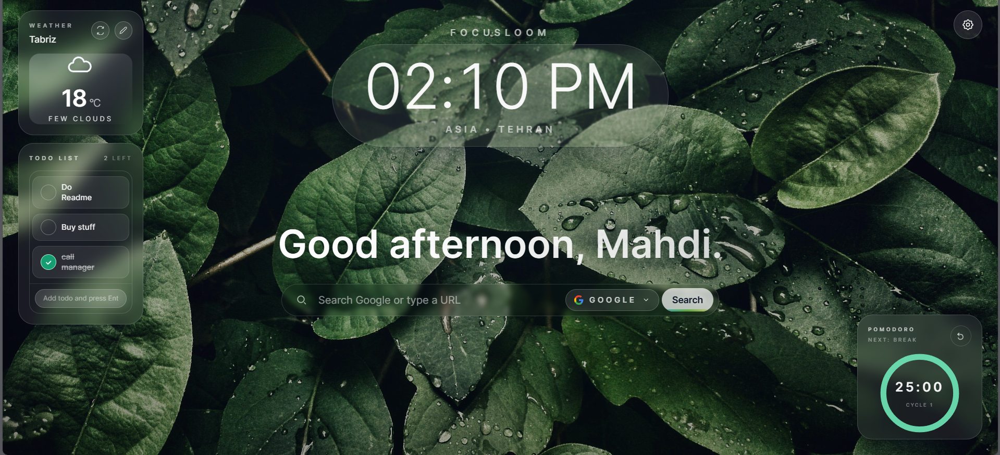
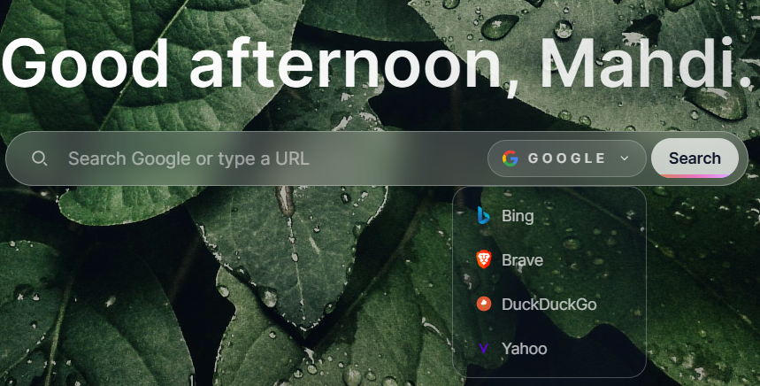
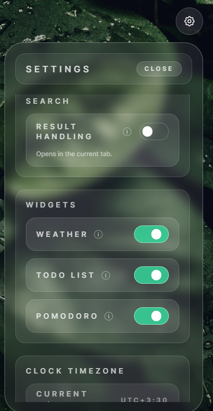
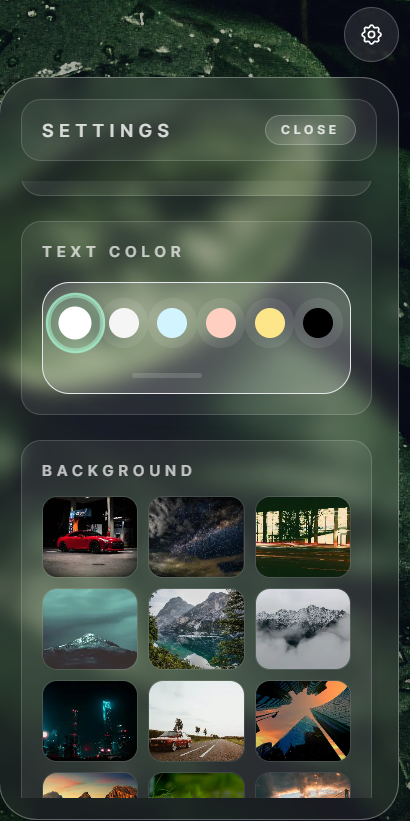

# FocusLoom - Browser-Tab-Focus

> The mindful new-tab dashboard that keeps your search, widgets, and daily focus rituals right where you need them.

[](https://github.com/Mahdirnj/Browser-Tab-Focus/releases)
[](https://github.com/Mahdirnj/Browser-Tab-Focus/issues)
[](https://github.com/Mahdirnj/Browser-Tab-Focus/stargazers)
[](https://github.com/Mahdirnj)

**FocusLoom** replaces the default browser tab with a calm, data-rich workspace. Dial in wallpapers, typography, and high-utility widgets, then ship it as a Chrome extension or keep iterating locally with Vite's instant-feedback dev server.

## Sneak Peek



| Search-first command bar | Layout tweaks | Advanced settings |
| --- | --- | --- |
|  |  |  |

## Table of Contents

1. [Vision](#vision)
2. [What's New in V2.0](#whats-new-in-v20)
3. [Key Features](#key-features)
4. [Tech Stack](#tech-stack)
5. [Getting Started](#getting-started)
6. [Scripts to Remember](#scripts-to-remember)
7. [Configuration & Personalization](#configuration--personalization)
8. [How to use](#how-to-use-and-apply-it)
9. [Changelog](#changelog)
10. [Contributing](#contributing)
11. [Support & Contact](#support--contact)

## Vision

FocusLoom is designed to make every new browser tab feel intentional. Instead of a blank page or distraction-heavy feed, you get:

- At-a-glance context (clock, greeting, weather).
- Lightweight productivity helpers (todos, Pomodoro timer).
- A fast search hub that responds to the way *you* browse.
- A polished UI that feels like a native part of your browser.

## What's New in V2.0

### New Features

| Feature | Description |
| --- | --- |
| **Daily Focus Widget** | Set a single goal for the day — displayed front and center, resets automatically at midnight. |
| **Daily Quote Widget** | A fresh quote appears each day from a bundled, offline quote library (no API needed). |
| **Pomodoro Notifications & Audio** | Browser notifications fire when a focus or break session ends, so you never miss a cycle. |
| **Custom Pomodoro Durations** | Set your own focus, short break, and long break times directly from the settings panel. |
| **Persistent Thumbnail Cache** | Background thumbnails in the settings panel are now stored in **IndexedDB**. They generate once and reload instantly on every subsequent tab — no canvas work on repeated opens. |

### Enhancements

#### Settings Panel — Full Redesign

- Flat glassmorphic card layout with icon-labelled section headers.
- Sections reordered by usage priority: Profile → Widgets → Search → Pomodoro → Text Color → Weather API → Timezone → Background.
- Quieter card style (`border-white/[0.09]`, no shadows) for less visual noise.
- Background grid now shows a white checkmark badge on the active option instead of a text label.

#### Performance & Responsiveness

- **Lazy-mount, never-unmount strategy** — the settings panel DOM is created on first open and stays mounted. All subsequent opens and closes are pure CSS (`opacity` + `transform`), eliminating the React tree re-mount overhead on every toggle.
- **Timezone search pre-computation** — `Intl.DateTimeFormat` calls are now batched inside a `useMemo` keyed to the result set, instead of running inline for every row on every keystroke. Typing in the timezone search is now instant.
- **Module-level widget and Pomodoro arrays** — definitions are no longer re-created as inline literals on every render pass.
- **Scoped CSS transitions** — replaced `transition-all` with specific property lists (`transition-[border-color,background-color,color]`) across all interactive elements for snappier perceived response.
- **Inline `backdropFilter` style** — applied via React `style` prop to guarantee correct compositing in all GPU-layer stacking contexts.

#### Bug Fixes

- **Gear button toggle** — clicking the gear icon while the settings panel was open used to close it and then immediately reopen it. Fixed by tracking the trigger button ref and excluding it from the click-outside handler.
- **Search engine dropdown backdrop blur** — the dropdown was appearing behind the search bar's own blur context. Resolved by rendering it via `ReactDOM.createPortal` into `document.body`.

## Key Features

- **Personal command center** — toggle widgets, choose from curated wallpapers, and pick a text color to match your vibe.
- **Daily productivity loop** — Pomodoro timer, daily goal, todo list, and a motivational quote — all in one tab.
- **Search without friction** — swap engines on the fly; results open in a new tab or the current one.
- **Persistence that just works** — todos, weather city, timer state, and all settings survive tab closes via `localStorage` and IndexedDB.
- **Chrome-extension ready** — `extension/` always mirrors the latest production build for fast packaging and upload.
- **Dev-friendly workflow** — Vite + React hot reload, clean component structure, and dedicated scripts for building and packaging.

## Tech Stack

- **Framework:** React 19, Vite 7
- **Styling:** Tailwind CSS v3, CSS custom properties for dynamic text color theming
- **Persistence:** `localStorage` via `src/utils/storage.js`, IndexedDB via `src/utils/thumbCache.js`
- **Extension runtime:** Chrome MV3, `chrome-extension://` local asset serving
- **Tooling:** ESLint, PostCSS, Stylelint, npm scripts, release zipper, and an extension sync script

## Getting Started

### Prerequisites

- Node.js 18+ (or the version defined in `package.json` engines).
- npm (ships with Node) or pnpm/yarn if you adapt the scripts.

### Run Locally

```bash
npm install
npm run dev
```

Then open `http://localhost:5173/` to explore the dashboard with hot reload.

## Scripts to Remember

| Command | What it does |
| --- | --- |
| `npm run dev` | Starts the Vite dev server with hot reload. |
| `npm run build` | Produces the production bundle in `dist/`. |
| `npm run build:extension` | Builds and copies the output into `extension/newtab/`. |
| `npm run package-extension` | Zips `extension/` into `release/focusloom-extension-v*.zip`. |
| `npm run release` | Full pipeline — build, sync, and package in one command. |

## Configuration & Personalization

- **Weather API** — Enter your OpenWeather API key in **Settings → Weather API**. It is stored locally and never leaves your device.
- **Pomodoro durations** — Customise focus, short break, and long break lengths in **Settings → Pomodoro**.
- **Widgets** — Toggle any widget on or off from **Settings → Widgets**. Preferences are saved instantly.
- **Storage helpers** — Use `src/utils/storage.js` for all `localStorage` access to keep key names consistent and avoid parsing errors.
- **Themes & wallpapers** — Background, text color, and layout changes apply and persist immediately.

## How to use and apply it

Head over to the [Releases Page](https://github.com/Mahdirnj/Browser-Tab-Focus/releases). Extract the zip file, open your browser's extension settings, enable **Developer mode**, click **Load unpacked**, and select the extracted folder.

Got a better idea? [Open an issue](https://github.com/Mahdirnj/Browser-Tab-Focus/issues/new) and let's talk.

## Changelog

### V2.0.0

- Added Daily Focus widget (single daily goal, midnight reset)
- Added Daily Quote widget (offline bundled quote library)
- Added Pomodoro browser notifications and audio
- Added custom Pomodoro durations in settings
- Added persistent IndexedDB thumbnail cache for background images
- Full Settings panel redesign — flat glassmorphic layout, reordered sections, icon headers
- Performance: lazy-mount / never-unmount strategy for settings panel
- Performance: pre-computed timezone search results (`useMemo`)
- Performance: module-level widget and Pomodoro definition arrays
- Performance: scoped CSS transitions replacing `transition-all`
- Fix: gear button toggling closed-then-reopened the settings panel
- Fix: search engine dropdown backdrop blur (portal to `document.body`)
- Updated React 18 → React 19, Vite 6 → Vite 7

### V1.0.0

- Initial release — clock, greeting, weather, todo list, Pomodoro timer, search bar, wallpaper selector, settings panel

## Contributing

1. Fork and clone the repo.
2. Create a feature branch (`git checkout -b feat/amazing-idea`).
3. Run `npm run lint` and `npm run build` before opening a PR.
4. Document UI/UX or packaging changes so reviewers can test them quickly.

## Support & Contact

- Star the repo if FocusLoom boosts your focus.
- File bugs or feature requests via [issues](https://github.com/Mahdirnj/Browser-Tab-Focus/issues).
- Say hi to **[@Mahdirnj](https://github.com/Mahdirnj)** on GitHub for collaboration, feedback, or showcasing your custom FocusLoom setups.

Stay sharp, keep the new-tab zen.
